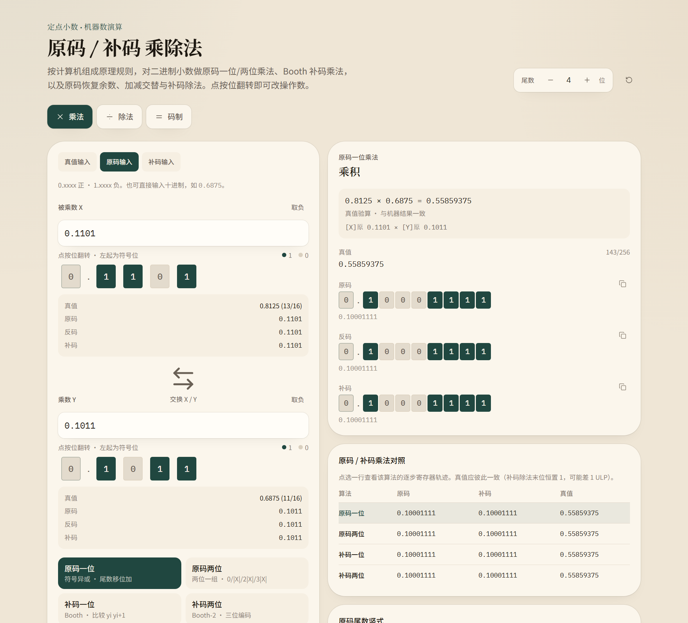

# 定点演算纸 · 定点小数机器数演算

一个单文件的网页演算台：按《计算机组成原理》的规则，对二进制定点小数做**原码 / 补码乘除法**，并给出逐步的寄存器轨迹、真值验算与多算法对照。

无依赖、无构建步骤 —— 双击 `index.html` 就能用。



## 功能

- **七种算法**：原码一位 / 两位乘法、Booth 补码一位 / 两位乘法、原码恢复余数除法、原码加减交替除法、补码加减交替除法
- **移位看得见**：步骤排成教科书的「部分积 / 乘数 / 操作说明」三列表；右移时滑进乘数的位成组加底色，小数点随之外移，不必逐行比对
- **三种输入码制**：真值、原码、补码，也可以直接输入十进制
- **尾数位数可调**（2–12），点按位翻转就能改操作数
- **逐步导航**：一次展开全部步骤，或逐步翻看
- **对照表**：同一组操作数下各算法结果并排，点选一行切到对应轨迹

## 使用

用浏览器打开 `index.html` 即可，不需要服务器，也不需要联网。

## 开发

源码放在 `build/`，由组装脚本合并成单文件：

```bash
node build/assemble.mjs                   # 生成 index.html
node build/logic.test.mjs                 # 逻辑测试
node build/verify.mjs                     # 产物静态校验
npm i jsdom && node build/dom.test.mjs    # UI 交互测试
```